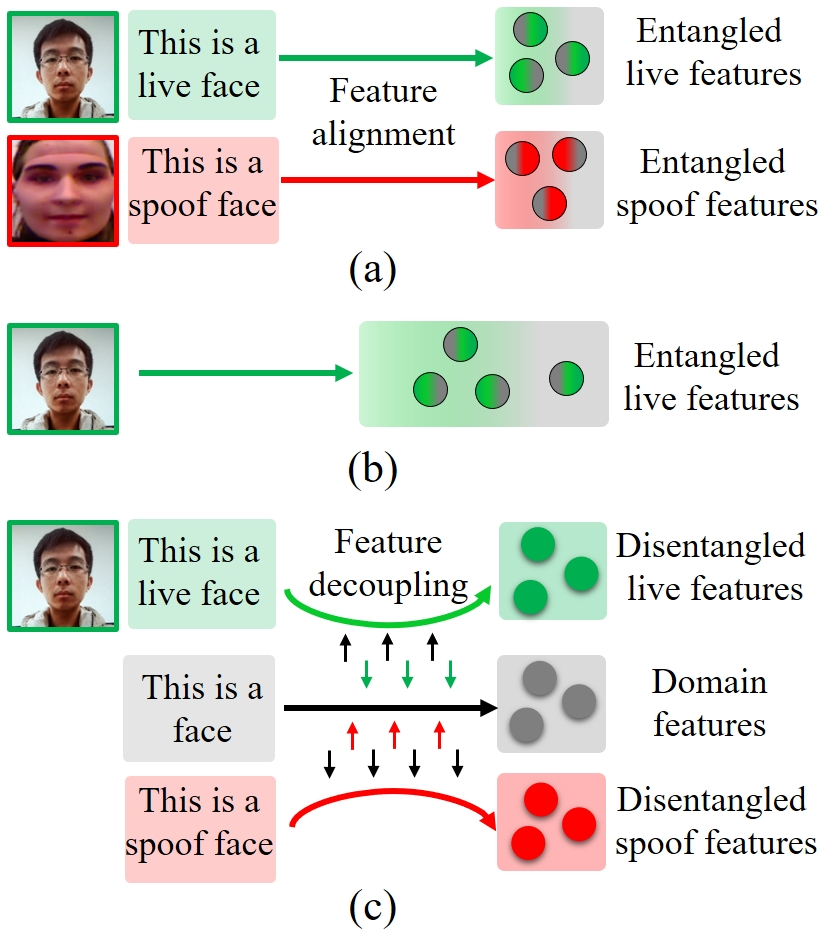
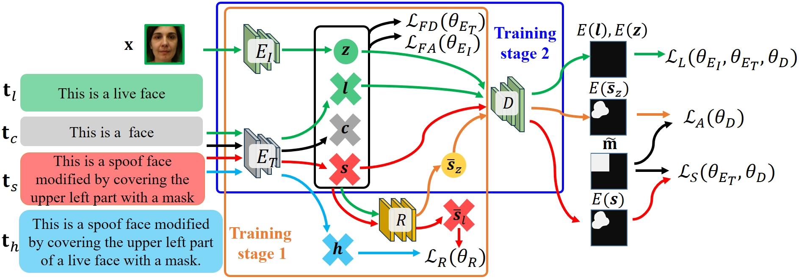

# AAAI25_SLIP
### SLIP: Spoof-aware one-class face anti-spoofing with Language Image Pretraining (AAAI '25)

## Illustration of the proposed idea of **S**poof-aware one-class face anti-spoofing with **L**anguage **I**mage **P**retraining (SLIP).


## Architecture of SLIP


## Training & Testing
Run `SLIP_train.py` to train SLIP

Run `SLIP_test.py` to test SLIP

## Packages
Run `pip install requirement.txt`

## Citation

If you use the OC-SCMNet, please cite the paper, thank you:
 ```
@inproceedings{huang2025slip,
  title={SLIP: Spoof-aware one-class face anti-spoofing with Language Image Pretraining},
  author={Huang, Pei-Kai and Chong, Jun-Xiong and Chiang, Cheng-Hsuan and Chen, Tzu-Hsien and Liu, Tyng-Luh and Hsu, Chiou-Ting},
  booktitle={Proceedings of the AAAI Conference on Artificial Intelligence},
  year={2025},
}

```
